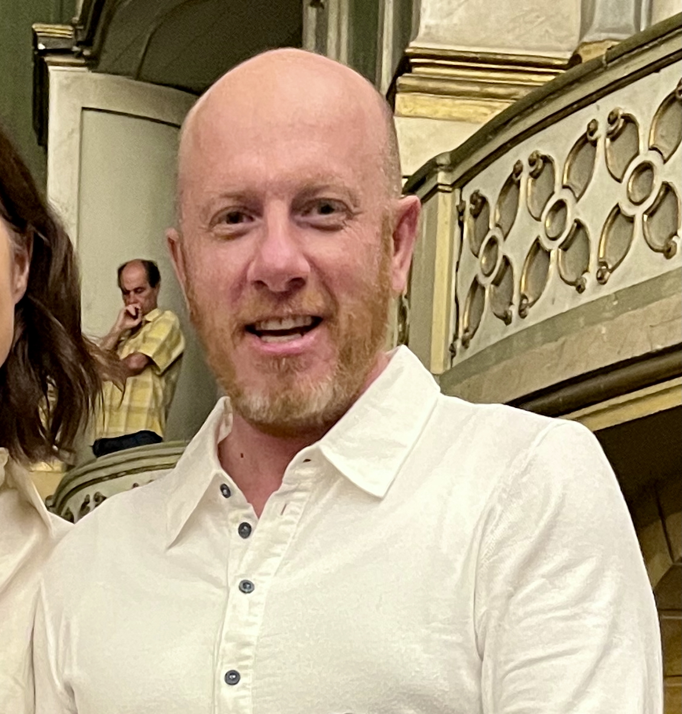

```{css, echo=FALSE}
/* Custom CSS for the resume */
/* define A4 size */
@page {
  size: A4 !important; 
  margin-top: 5mm;
  margin-bottom: 5mm;
  margin-left: -20mm;
  margin-right: -20mm;
}

/* Reduce top margin for the entire document */
.pagedjs_page {
  padding-top: 5px !important;
  margin-top: -15mm !important;  /* Reduce but prevent overlap */
  transform: scale(1) !important;
  zoom: 1 !important;
}

/* Reduce spacing before first section */
#resume, h1:first-of-type {
  margin-top: 5px !important;  /* Adjust this value as needed */
  margin-bottom: 0px !important;  /* Adjust this value as needed */
  padding-top: 5px !important;
  padding-bottom: 5px !important;
}

/* ---- Reduce Top Margin of the Aside ---- */
#aside {
  position: absolute;  /* Keep the aside in a fixed place */
  top: -25mm !important;  /* Move it up */
}

#aside {
    padding-top: 0.2em; /* Adjusts top padding */
}

/* Reduce spacing before first section */
#resume, h1:first-of-type {
  margin-top: 0.1em;
  margin-bottom: 0em; /* Reduce space below section headings */
}

#aside h2, #aside h3, #aside p {
    margin-bottom: 0.1em; /* Reduce space below section headings */
}
```

```{css, echo=FALSE}
@media print {
  body {
    font-size: 12pt; /* Adjust font size for printing */
  }
  .pagedjs_page {
    margin-top: 0 !important; /* Reset top margin for printing */
    margin-bottom: 0 !important; /* Reset bottom margin for printing */
  }
  /* Add more print-specific styles here */
}
```


# Aside {#aside}



*Imprenditore dinamico, sportivo eclettico e amante della musica. 25 anni di esperienza nella produzione di tessuti tecnici, applicati a settori industriali, acquacoltura e agricoltura. Vivo il mercato, certo della rete di relazioni umane intessuta negli anni, che lega saldamente clienti e partner. Credo nelle sfide quale strumento di arricchimento personale e cerco nuove opportunità in ruoli gestionali o commerciali.*

## Contatti {#contact}

-   <i class = "fa fa-map-location-dot"></i> Pavia (PV), Italy
-   <i class = "fa fa-phone"></i> +39-348-5207576
-   <i class="fa fa-envelope"></i> [tais\@tiscali.it](mailto:tais@tiscali.it){.email}
-   <i class = "fa fa-globe"></i> [www.daviderossetti.net](https://daviderossetti.net)
-   <i class = "fa fa-linkedin"></i> [LinkedIn profile](https://www.linkedin.com/in/davide-rossetti-a13909b/)
<!-- -   <i class="fa fa-github"></i> [github.com/JessAus](https://github.com/JessAus) -->


## Lingue e IT {#skills}

- Inglese (C1)
- Francese (B1)
- MS Office
- Software di gestione aziendale


## Competenze {#skills}

- R Package Development
- Quarto / RMarkdown
- Shiny App Development
- Data Visualization
- Data Analysis
- Data Security
<!-- -   API Integration -->
<!-- -   Process Automation -->
<!-- -   Git / GitHub -->
<!-- -   PostgreSQL -->
<!-- -   Snowflake -->
<!-- -   Database Management -->
<!-- -   Project Management -->
<!-- -   Communication Skills -->
<!-- -   Statistics Foundations -->

<!-- ## Disclaimer {#disclaimer} -->

<!-- This resume was made with the R package [**pagedown**](https://github.com/rstudio/pagedown). --> 

# Main

## Davide Rossetti {#title}

### *Imprenditore nel settore tessile*


## Esperienza Professionale {data-icon="suitcase"}
<!-- {data-icon="laptop"} -->

<!-- ### Title -->
<!-- org -->
<!-- where -->
<!-- when -->

<!-- -  Description 1 -->
<!-- -  Description 2 -->
<!-- -  Description 3 -->


### Titolare Ditta Individuale

TAIS di Davide Rossetti

Pavia (PV)

Feb 2014 - Oggi 

 - *Gestito NN commesse per tessuti ad uso tecnico e industriale assicurando un fatturato medio di EURO? all'anno*
 - *Analizzato le tendenze di mercato per prevedere la domanda e le tendenze d'acquisto nei segmenti di riferimento*
 - *Stipulato NN accordi strategici con fornitori funzionali alla crescita e alla competitività d'impresa*

### Responsabile Commerciale

Rossetti Antonio S.a.s.

Chioggia (VE),

Nov 2012 - Gen 2014

 - *Razionalizzato la produzione di tessuti a rete per la pesca, lo sport, e allevamenti ittici e agricoltura*
 - *Consolidato e fidelizzato un portafoglio di NN clienti in Italia ed Europa pergarantirne puntuale soddisfazione*

### Amministratore delegato e socio di maggioranza

Manifattura T.A.I.S. S.r.l. 

Terenzano (UD),

Ott 2001 - Ott 2012

 - Negoziato acquisizione di storica azienda fornitrice di filati (Tais) e gestito la progressiva integrazione nell'impresa di famiglia
 - *Realizzato NN prototipi ad hoc per lo sviluppo di materiali e soluzioni innovative secondo i requisiti richiesti dal cliente*

### Responsabile produzione, confezione tessile artigianale

Rossetti Antonio S.n.c.

Chioggia (VE)

Ott 1993 - Feb 2006

 - Pianificato e programmato commesse per la GDO
 - Implementato **'distinta base' su gestionale in ambiente AS400**
 - Automatizzato taglio tessuti
 - Progettato e realizzato **'macchinari speciali'**

### Direttore vendite al dettaglio e all’ingrosso

Rossetti Antonio S.n.c. 

Chioggia (VE),

Gen 1990 - Set 1993

 - Coordinato raccolta ordini, logistica e distribuzione per grossisti in Italia
 - Gestito punto vendita per pesca, acquacoltura, sport e nautica
 - Aperto e diretto negozio di abbigliamento tecnico e moda mare
 - Ricercati e gestiti fornitori di materie prime

## Istruzione e Formazione {data-icon="graduation-cap" data-concise="true"}

### Corso sul Controllo di Gestione e Contabilità Industriale
Associazione Piccole Medie Imprese (API)

Udine (UD)

Ott/Nov 2005

### Corso operatori in commercio estero
Camera di Commercio di Venezia 

Treviso (TV)

Apr/Mag 2005

### Percorso formativo per giovani imprenditori
Scuola di Impresa (CDO), Fondazione “Alma Mater” 

Bologna (BO)

2000--2001

### Full time English Language Course
The Manchester Academy of English, University of Manchester

Manchester (UK)

Mar 1995 - Giu 1995	

### Corso di studi da Geometra 

Istituto Tecnico Industriale Statale “A.Righi” | Istituto Tecnico per Geometri “G.Massari”  

Chioggia (VE) | Mestre (VE)

Set 1984 - Giu 1990

<!-- - Principali tematiche: la conoscenza del mercato, la gestione economico-finanziaria, l’ottimizzazione dei processi produttivi (supply chain management), l’internazionalizzazione e la promozione del Made il Italy, la conduzione delle persone. -->


 

<!-- ## Extracurricular Activities & Honors {data-icon="suitcase"} -->

<!-- ### School of Public Health Student Ambassador -->

<!-- University of North Texas Health Science Center -->

<!-- Fort Worth, TX -->

<!-- 2021--2022 -->

 

<!-- ## Products {data-icon="screwdriver-wrench"} -->
<!-- ### School of Public Health Student Ambassador -->

<!-- University of North Texas Health Science Center -->

<!-- Fort Worth, TX -->

<!-- 2021--2022 -->

<!-- -   Nomination-based student organization -->

## Brevetti {data-icon="lightbulb"}

### Brevetto di invenzione

University of North Texas Health Science Center

Fort Worth, TX

2021--2022 
 
### Brevetto 

University of North Texas Health Science Center

Fort Worth, TX

2021--2022 
 
```{r, echo=FALSE, output=TRUE, results='asis'}
cat("\\noindent\\rule{\\textwidth}{0.4pt} \\vspace{5mm} \n") 
cat("\\noindent\\textit{Last updated on: ", format(Sys.time(), "%d %B, %Y"), "} \\par \n")
```

